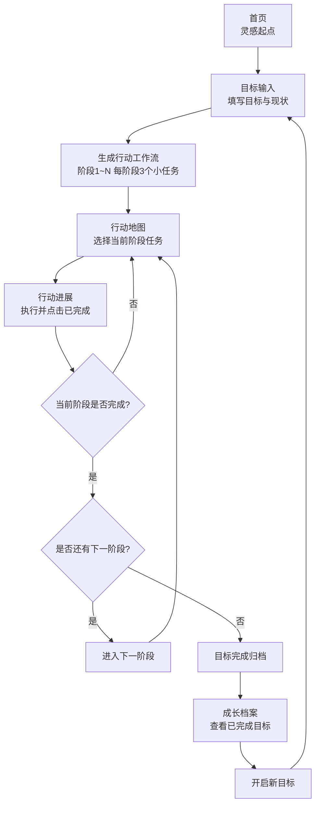

# Start Now · 对外展示型 PRD（V1）

> 让“我想开始”变成“我已经开始”  
> 版本：V1（MVP 可运行版）

---

## 1. 项目一句话

**Start Now** 是一款面向“有目标但迟迟无法启动”的用户的行动型 Web 产品。  
它通过“目标拆解 -> 路径选择 -> 行动反馈 -> 成长归档”的闭环，帮助用户从第一步持续走到结果。

---

## 2. 为什么做这个产品

### 用户真实痛点
- 目标很明确，但第一步不明确
- 信息很多，行动很少
- 做了一点看不到进展，容易中断

### 产品价值
- 把“大目标”变成“马上能做的小动作”
- 用阶段与进度可视化降低放弃率
- 让每次完成都被记录，形成正反馈

---

## 3. MVP 交付内容（已实现）

### 页面能力
- **灵感起点（Home）**：品牌心智 + 一键进入行动
- **目标输入（GoalInput）**：输入目标与背景，生成行动工作流
- **行动地图（PathSelect）**：按阶段展示可选小任务，支持连续推进
- **行动进展（Progress）**：任务完成、阶段切换、登山进度动画、庆祝反馈
- **成长档案（Dashboard）**：查看当前进度与已完成目标历史

### 关键体验点
- 完成按钮触发 confetti
- 小人沿山路动态前进（随总进度变化）
- 阶段完成后进入下一阶段
- 全部完成后自动归档并支持开启新目标

---

## 4. 用户旅程流程图

---

## 5. 商业与增长意义（对外沟通口径）

### 可验证的核心指标（MVP）
- 首次目标创建率
- 第一任务完成率
- 阶段完成率
- 单目标完结率
- 次目标开启率（复用率）

### 产品增长潜力
- 从“单次打卡工具”升级为“连续目标系统”
- 可自然延展出会员服务（高级拆解、陪跑计划、教练模板）
- 可沉淀长期成长数据，形成复购与社交传播基础

---

## 6. 技术实现概览（对外简版）

- 前端：React + TypeScript + Tailwind
- 路由：React Router
- 动画：Lottie + Confetti
- 数据：localStorage（MVP）
- AI 拆解：当前为 mock，后续接入大模型 API（DeepSeek）

---

## 7. 当前边界与下一步

### 当前边界（MVP）
- 目标拆解模板仍为 mock
- 登录与云端同步尚未接入
- 成长档案已完成列表能力，详情页待扩展

### 下一步（V1.1）
1. 接入真实大模型拆解  
2. 登录后跨设备同步  
3. 成长档案支持目标详情/筛选/统计  
4. 轻量化动画资源与首屏性能优化

---

## 8. 对外演示建议（5 分钟版本）

1. 用一句话说明痛点  
2. 现场输入目标并生成行动路径  
3. 连续完成几步，展示阶段推进与庆祝反馈  
4. 完成目标后进入成长档案，展示“完成记录可沉淀”  
5. 收束到“从启动困难到持续行动”的价值主张

